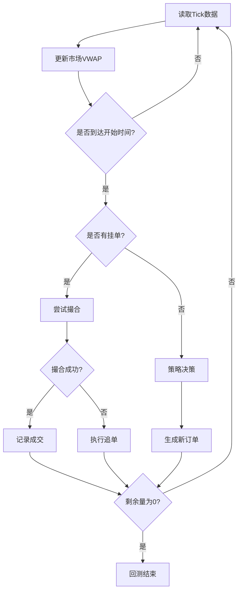

# 期货算法交易回测系统

一个高性能的期货算法交易回测框架，支持多策略并行回测、精确撮合引擎和全面性能分析。

## 🎯 项目特色

- 🚀 **多进程并行回测**: 支持多文件并行处理，显著提升回测效率
- ⚡ **精确撮合引擎**: 基于tick级别的逐笔撮合，模拟真实交易环境
- 📊 **多策略框架**: 内置4种主流冰山算法策略，支持自定义扩展
- 📈 **全面性能评估**: 包含VWAP、滑点、执行时长等关键交易指标
- 🔧 **灵活配置**: 支持多档位数据、自定义参数和实时监控

## 📁 项目结构

```
algorithm_test/
├── 核心引擎 core/
│   ├── __init__.py              # 核心模块导出
│   ├── backtest_engine.py       # 回测引擎 - 驱动整个回测流程
│   ├── matching_engine.py       # 撮合引擎 - 订单匹配与成交逻辑
│   ├── market_data.py          # 市场数据 - tick数据结构和读取器
│   └── metrics.py              # 指标统计 - 性能评估和分析
├── 策略框架 strategy/
│   ├── __init__.py             # 策略模块导出
│   ├── base_strategy.py        # 策略基类 - 定义策略标准接口
│   ├── ice_best.py            # 冰山对价策略 - 主动成交
│   ├── ice_hang.py            # 冰山挂价策略 - 被动等待
│   ├── ice_smart.py           # 冰山智能策略 - 智能切换
│   └── ice_smart_only_imbalance.py  # 失衡策略 - 条件触发
├── 工具集 tools/
│   ├── __init__.py            # 工具模块导出
│   ├── contract_multiplier.py # 合约配置 - 期货合约参数管理
│   ├── ice_smart_caculator.py # 智能计算器 - 策略参数优化
│   └── data_evaluation.py     # 数据评估 - 盘口失衡信号分析
├── 测试与比较
│   ├── algorithm_comparison.py         # 策略比较器 - 单文件策略对比
│   └── algorithm_comparison_test_data.py # 批量测试 - 多文件并行回测
├── 测试数据 test_data/
│   ├── CFFEX.*.csv            # 中金所品种 (股指、国债)
│   ├── DCE.*.csv              # 大商所品种 (农产品、化工)
│   ├── SHFE.*.csv             # 上期所品种 (金属、能源)
│   ├── INE.*.csv              # 上海国际能源中心
│   └── GFEX.*.csv             # 广期所品种
└── 输出结果 results/
    └── (回测结果文件)
```

## 🔧 核心架构

### 1. 撮合引擎 (core/matching_engine.py)

撮合引擎是系统的核心组件，负责模拟真实交易所的订单匹配逻辑。

#### 撮合原理
```python
def match(order: Order, tick: Tick) -> Optional[Fill]:
    """
    基于下一tick对手价的撮合逻辑：
    
    买单撮合条件: order.price >= tick.ask (委托价 >= 卖一价)
    卖单撮合条件: order.price <= tick.bid (委托价 <= 买一价)
    
    成交价格: 按对手价成交 (买单按ask价，卖单按bid价)
    """
```

#### 核心特性
- **tick级精度**: 每个tick都进行撮合判断，确保时序准确性
- **对手价成交**: 模拟真实市场的价格穿透机制
- **全量成交**: 支持订单的整笔成交，简化回测逻辑

### 2. 回测引擎 (core/backtest_engine.py)

回测引擎采用事件驱动模式，逐tick推进回测进程。

#### 回测流程


#### 关键机制
- **策略驱动**: 通过策略接口 `on_tick()`, `on_fill()`, `chase()` 控制交易行为
- **状态管理**: 维护挂单状态、剩余数量、成交记录等
- **性能统计**: 实时收集VWAP、滑点、执行时间等指标

### 3. 策略框架 (strategy/)

所有策略继承自 `BaseStrategy`，实现统一的交易接口：

```python
class BaseStrategy(ABC):
    @abstractmethod
    def on_tick(self, tick: Tick) -> Optional[Order]:
        """处理新tick，决定是否下单"""
        pass
    
    @abstractmethod
    def on_fill(self):
        """处理成交回报，更新状态"""
        pass
    
    @abstractmethod
    def chase(self, tick: Tick) -> Order:
        """追单逻辑，处理未成交订单"""
        pass
```

## 📋 策略详解

### 1. 冰山对价策略 (IceBestStrategy)
**核心理念**: 主动成交，快速执行

```python
# 下单逻辑
price = tick.ask if self.side == "buy" else tick.bid  # 买单打ask，卖单打bid

# 追单逻辑  
def chase(self, tick: Tick) -> Order:
    self.pending = None  # 撤销当前挂单
    price = tick.ask if self.side == "buy" else tick.bid  # 重新按对手价挂单
    return self._new_order(price, tick.ts)
```

**适用场景**: 急需快速成交、市场流动性充足的情况

### 2. 冰山挂价策略 (IceHangStrategy)  
**核心理念**: 被动等待，降低成本

```python
# 下单逻辑
price = tick.bid if self.side == "buy" else tick.ask  # 买单挂bid，卖单挂ask

# 优化追单逻辑
def chase(self, tick: Tick) -> Order:
    new_price = tick.bid if self.side == "buy" else tick.ask
    if abs(new_price - self.pending.price) < 1e-6:  # 价格未变化
        return self.pending  # 不执行撤单重挂
    # 价格变化才撤单重挂
    return self._new_order(new_price, tick.ts)
```

**适用场景**: 对成交时间不敏感、希望降低交易成本的情况

### 3. 冰山智能策略 (IceSmartStrategy)
**核心理念**: 根据市场微观结构智能切换报价方式

#### 智能判断算法
```python
def _should_use_market_price(self, tick: Tick) -> bool:
    """
    双重条件判断：
    1. 盘口失衡: |Q| > threshold, Q = (总买量-总卖量)/(总买量+总卖量)
    2. micro-price方向: 量加权中间价的趋势方向
    
    支持多档深度计算（1档或5档）
    """
    # 多档计算示例（5档）
    total_bid_vol = sum(tick.bid_volumes[:5])
    total_ask_vol = sum(tick.ask_volumes[:5])
    Q = (total_bid_vol - total_ask_vol) / (total_bid_vol + total_ask_vol)
    
    # micro-price计算
    weighted_bid_price = sum(tick.bids[i] * tick.bid_volumes[i] for i in range(5)) / total_bid_vol
    weighted_ask_price = sum(tick.asks[i] * tick.ask_volumes[i] for i in range(5)) / total_ask_vol
    micro_price = (weighted_bid_price * total_ask_vol + weighted_ask_price * total_bid_vol) / (total_bid_vol + total_ask_vol)
    
    # 方向判断
    if self.side == "buy":
        return (Q > threshold) and (abs(micro_price - tick.ask) < abs(micro_price - tick.bid))
    else:
        return (Q < -threshold) and (abs(micro_price - tick.bid) < abs(micro_price - tick.ask))
```

**智能策略优势**:
- **自适应**: 根据实时市场状态动态调整
- **多档支持**: 利用更深的市场信息提升判断准确性  
- **成本优化**: 在保证执行的前提下降低交易成本

### 4. 智能失衡策略 (IceSmartOnlyImbalanceStrategy)
**核心理念**: 仅在市场显著失衡时才执行交易

**特点**: 更保守的交易策略，只在确定性机会出现时行动

## 📊 性能指标体系

### 核心指标说明
- **平均成交价格**: 策略实际执行的量加权平均价格
- **市场VWAP**: 同期市场成交量加权平均价格（基准）
- **价格滑点**: 相对于市场VWAP的成本差异
  - 买入滑点 = 平均成交价 - 市场VWAP  
  - 卖出滑点 = 市场VWAP - 平均成交价
- **执行时长**: 从首次下单到最后成交的时间
- **成交笔数**: 总共产生的成交次数
- **委托笔数**: 总共发送的订单数量

### 滑点分析
正滑点表示执行成本，负滑点表示执行收益：
- **冰山对价**: 通常产生正滑点，但执行速度快
- **冰山挂价**: 可能产生负滑点，但执行时间长
- **智能策略**: 在两者间寻求平衡

## 🚀 快速开始

### 环境要求
```bash
pip install pandas numpy
```

### 基本使用
```bash
# 单文件回测
python algorithm_comparison.py

# 批量多进程回测（推荐）
python algorithm_comparison_test_data.py

# 指定参数回测
python algorithm_comparison_test_data.py --processes 8 --side buy --qty 100 --slice 10
```

### 高级配置
```bash
# 性能基准测试
python algorithm_comparison_test_data.py --benchmark

# 单进程模式（调试用）
python algorithm_comparison_test_data.py --no-multiprocess

# 自定义策略参数
python algorithm_comparison_test_data.py --threshold 0.15 --start-time "09:30:00"
```

## 🎛️ 自定义策略开发

### 1. 继承基类
```python
from strategy.base_strategy import BaseStrategy
from core.market_data import Tick
from core.matching_engine import Order

class MyCustomStrategy(BaseStrategy):
    def __init__(self, side: str, total_qty: int, **kwargs):
        super().__init__(side, total_qty)
        # 自定义参数初始化
        
    def on_tick(self, tick: Tick) -> Optional[Order]:
        # 实现下单逻辑
        pass
        
    def on_fill(self):
        # 实现成交处理
        pass
        
    def chase(self, tick: Tick) -> Order:
        # 实现追单逻辑
        pass
```

### 2. 集成到比较框架
```python
# 在algorithm_comparison.py中添加
strategies["我的策略"] = MyCustomStrategy(side, total_qty, slice_qty)
```

## 🛠️ 工具集使用

### 数据评估工具 (tools/data_evaluation.py)
分析盘口失衡信号的有效性：
```bash
python tools/data_evaluation.py
```

### 智能计算器 (tools/ice_smart_caculator.py)
优化智能策略参数：
```bash
python tools/ice_smart_caculator.py
```

## 📈 性能优化

### 多进程配置
- **默认进程数**: CPU核心数 - 1
- **内存考虑**: 每进程约需要100-500MB内存
- **最优配置**: 文件数量 >= 进程数 × 2

### 数据优化
- **预读取机制**: 避免重复读取同一文件
- **内存缓存**: 大批量测试时缓存tick数据
- **SSD推荐**: 显著提升数据加载速度

### 性能基准
在典型配置下（8核CPU，32GB内存，SSD）：
- **单进程**: ~2.5秒/文件
- **8进程**: ~0.4秒/文件  
- **理论加速比**: ~6.25x
- **实际加速比**: ~5.5x（考虑I/O开销）

## 🔍 数据格式

支持标准期货tick数据格式：
```csv
datetime,bid_price1,ask_price1,bid_volume1,ask_volume1,last_price,volume,amount
2024-01-01 09:30:00,3000.0,3000.5,10,15,3000.2,5,15001.0
```

高级格式支持（5档）：
```csv
datetime,bid_price1,bid_price2,...,bid_price5,ask_price1,...,ask_price5,bid_volume1,...,bid_volume5,ask_volume1,...,ask_volume5
```

## 🤝 贡献指南

1. Fork项目仓库
2. 创建特性分支 (`git checkout -b feature/AmazingFeature`)
3. 提交更改 (`git commit -m 'Add some AmazingFeature'`)
4. 推送分支 (`git push origin feature/AmazingFeature`)
5. 创建Pull Request

## 📄 许可证

本项目采用MIT许可证 - 查看 [LICENSE](LICENSE) 文件了解详情

## ⚠️ 免责声明

本项目仅供学习和研究使用，不构成任何投资建议。实际交易存在风险，请谨慎操作。 